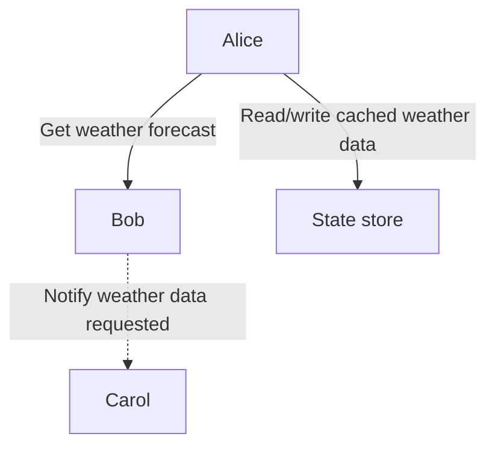

# .NET Aspire sample with Dapr

> Read the associated blog post: [.NET Aspire is the best way to experiment with Dapr during local development](https://anthonysimmon.com/dotnet-aspire-best-way-to-experiment-dapr-local-dev/).

This is a sample .NET Aspire app host that orchestrates three services:

1. An ASP.NET Core minimal API named "alice" that uses Dapr service invocation to call the "bob" service in order to retrieve the weather forecast. The results are then cached in a Dapr state store.
2. An ASP.NET Core minimal API named "bob" that returns weather forecast data, but the endpoint is voluntarily flaky and can return errors. When a weather forecast is successfully returned to a client, the "bob" service will publish an event using Dapr pub/sub.
3. A Node.js express app named "carol" that listens to the "bob" service events of weather forecasts being published and logs them to the console.

All the services are instrumented using OpenTelemetry to collect traces, logs, and metrics.

Because the "bob" service is flaky, a Dapr resiliency policy is configured to retry the service invocation. The corresponding Dapr resource is loaded by the "alice" service Dapr sidecar.

## Requirements

- [.NET 8.0 SDK](https://dotnet.microsoft.com/en-us/download/dotnet/8.0)
- [.NET Aspire workload](https://learn.microsoft.com/fr-fr/dotnet/aspire/)
- [Node.js 20.10+](https://nodejs.org/en/download)
- [Docker Desktop](https://www.docker.com/products/docker-desktop/)
- [Dapr CLI](https://docs.dapr.io/getting-started/install-dapr-cli/)

## Running the apps

- Clone this repository.
- Execute `dotnet run` inside the `AspireDaprDemo.AppHost/` directory.
- Browse to https://localhost:17262 to open the .NET Aspire dashboard.
- Click on the first endpoint of the "alice" service to retrieve the weather forecast from "bob" and let "carol" log the event.
- Use the "Traces" view to monitor the operation.

